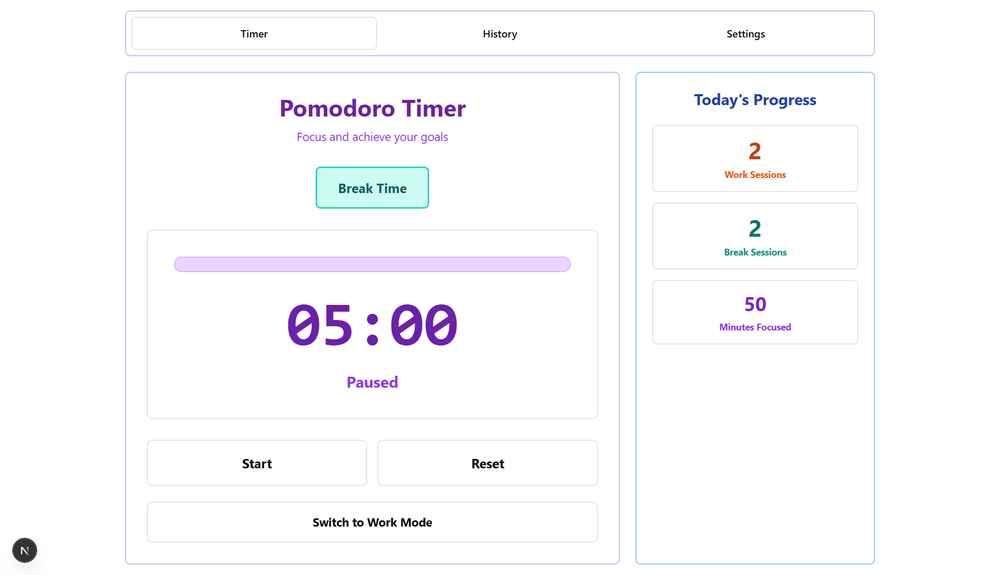

# Pomodoro Timer App

Một ứng dụng Pomodoro Timer hiện đại được xây dựng với React và Next.js, giúp quản lý thời gian làm việc hiệu quả theo phương pháp Pomodoro Technique.

## Screenshots



## Tính năng chính

- **Timer Pomodoro** - Đếm ngược thời gian làm việc và nghỉ ngơi
- **Thông báo** - Nhắc nhở khi hết thời gian với âm thanh và thông báo hệ thống
- **Theo dõi thống kê** - Thống kê số phiên làm việc theo ngày và tổng cộng
- **Lịch sử phiên làm việc** - Xem lại các phiên làm việc đã hoàn thành
- **Cài đặt tùy chỉnh** - Điều chỉnh thời gian làm việc và nghỉ ngơi

## Công nghệ sử dụng

### Frontend Framework
- **React 19** - Thư viện JavaScript cho giao diện người dùng
- **Next.js 15** - Framework React với SSR và SSG
- **TypeScript** - Ngôn ngữ lập trình có kiểu dữ liệu

### Mobile & Desktop
- **Capacitor** - Framework để build ứng dụng native
- **Local Notifications** - Thông báo trên thiết bị
- **Haptics** - Rung phản hồi

## Cài đặt

### Yêu cầu hệ thống
- Node.js 18+ 
- npm, yarn, hoặc pnpm

### Clone repository
```bash
git clone https://github.com/bichle04/pomodoro-app.git
cd pomodoro-app
```

### Cài đặt dependencies
```bash
# Sử dụng npm
npm install

# Hoặc sử dụng yarn
yarn install

# Hoặc sử dụng pnpm
pnpm install
```

### Chạy ứng dụng development
```bash
# Sử dụng npm
npm run dev

# Hoặc sử dụng yarn
yarn dev

# Hoặc sử dụng pnpm
pnpm dev
```

Mở [http://localhost:3000](http://localhost:3000) để xem ứng dụng.

### Build cho production
```bash
npm run build
npm start
```

## Cách sử dụng

1. **Bắt đầu timer** - Nhấn nút Start để bắt đầu phiên làm việc
2. **Tạm dừng/Tiếp tục** - Nhấn nút Pause để tạm dừng, Play để tiếp tục
3. **Reset timer** - Nhấn nút Reset để bắt đầu lại
4. **Xem thống kê** - Theo dõi số phiên đã hoàn thành
5. **Cài đặt** - Tùy chỉnh thời gian làm việc và nghỉ ngơi
6. **Lịch sử** - Xem các phiên làm việc đã hoàn thành

## Cấu trúc dự án

```
pomodoro-app/
├── app/                    # Next.js App Router
├── components/             # shadcn/ui components
├── src/
│   ├── components/         # React components chính
│   │   ├── PomodoroTimer.jsx
│   │   ├── SessionHistory.jsx
│   │   └── Settings.jsx
│   └── services/           # Logic services
│       ├── timer.js        # Pomodoro timer logic
│       ├── notifications.js # Notification service
│       └── storage.js      # Local storage service
├── public/                 # Static assets
└── styles/                 # Global CSS styles
```

---

Được phát triển bởi [bichle04](https://github.com/bichle04)